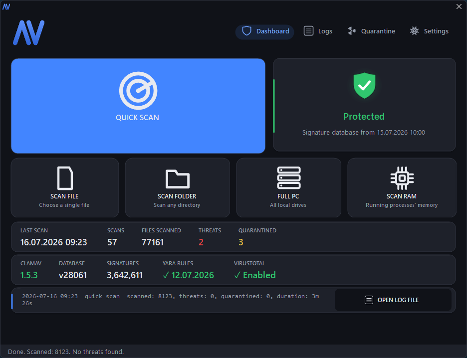
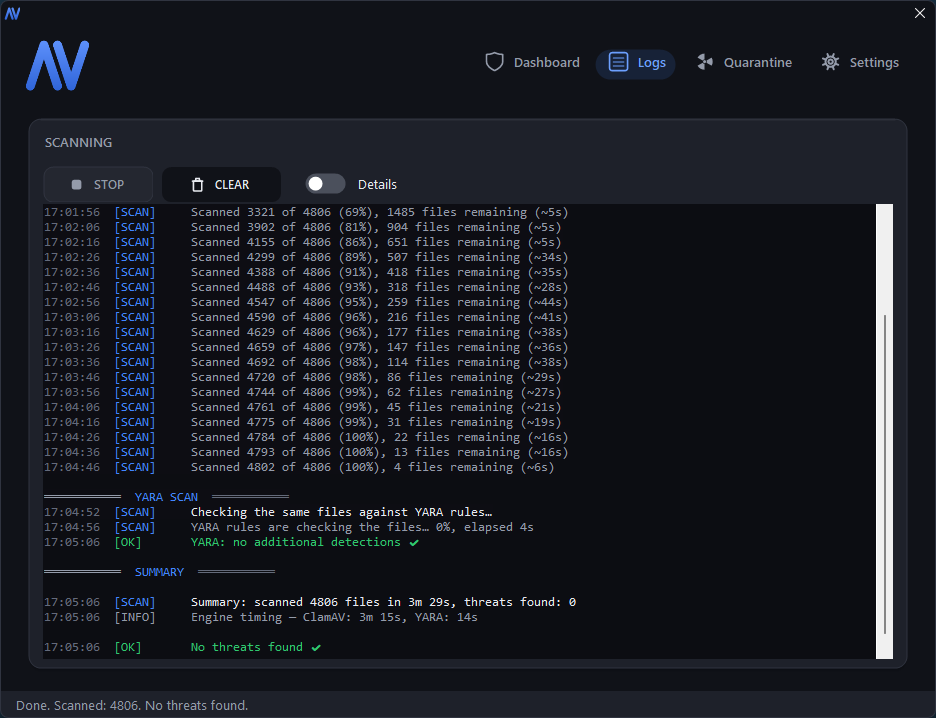
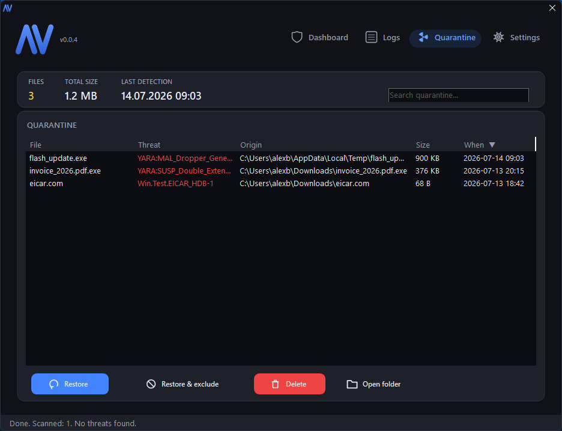
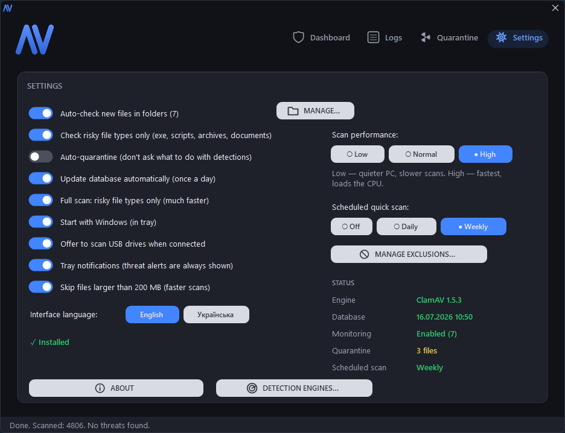

# AV

<p align="center">
  
</p>

[](LICENSE)
[](https://www.microsoft.com/windows)
[](https://dotnet.microsoft.com/download/dotnet-framework/net48)

<p align="center">
  
  
</p>
<p align="center">
  
  
</p>

A lightweight **multi-engine antivirus for Windows**. Three layers of detection
in one ~280 KB portable exe with **zero dependencies and zero toolchains** —
builds with the `csc.exe` compiler already built into Windows (.NET Framework
4.8, present on Win10/11):

1. **ClamAV** — the classic signature engine (official, unmodified binaries,
   downloaded automatically);
2. **YARA rules** — a second detection engine running community rules from
   [YARA Forge](https://yarahq.github.io/) (plus your own custom `.yar` files)
   over every scan, catching malware families and fresh threats the signature
   database misses;
3. **VirusTotal** — suspicious and unknown files are checked by SHA256 hash
   against 70+ engines; files VirusTotal has never seen can (opt-in) be
   uploaded for analysis.

The interface is available in **English** (default) and **Ukrainian**,
switchable anytime from Settings.

## Why this project?

Windows Defender is excellent, and this project is not intended to replace it. Instead, it serves as a lightweight power-tool demonstrating how distinct, decoupled malware detection systems can be orchestrated under a single portable dashboard entirely built in C# — keeping resource footprint minimal while maximizing coverage with local signatures, local heuristic rules, and cloud reputational vetting.

## Resource & Performance Focus
* **Executable size:** ~280 KB (single portable EXE, zero dependencies)
* **Downloads footprint:** ClamAV binary assets and database (~220 MB total) + YARA core ruleset (~15 MB total)
* **Typical memory profile:**
  * **While Idle:** < 15 MB RAM (in system tray)
  * **While Scanning:** ~80 MB RAM for the coordinator UI (`AV.exe`)
    * *Note:* Scanning spawning sub-processes will allocate memory on demand. The ClamAV resident database backend (`clamd`) uses ~1.2 GB RAM (loaded only for the active scan duration), and the `yara64` heuristic process typically uses ~150 MB RAM while evaluating rules.

## Scan Architecture & Flow

```
               Scan Input (Disk / RAM / New File Event)
                                 │
                        ┌────────┴────────┐
                        ▼                 ▼
                     ClamAV              YARA
                   Signatures         Heuristics
                        │                 │
                        └────────┬────────┘
                                 ▼
                             Suspicion
                                 │
                                 ▼
                            VirusTotal
                            Arbitration
                                 │
                                 ▼
                          Threat Decision
                        ┌────────┴────────┐
                        ▼                 ▼
                     Quarantine         Exclusion
```

## How the three engines work together

Every scan (manual, quick, full, RAM, and the automatic new-file monitor) runs
in phases over the exact same file list:

1. **ClamAV** scans the files (manual scans use the fast `clamd` daemon with
   parallel workers, falling back to `clamscan` automatically; the small
   new-file batches from the monitor go straight to `clamscan`).
2. **YARA** re-checks the same list — including the dumped process memory —
   with `yara64 --scan-list`. A ClamAV detection is a *verdict*; a single
   community-rule match is only a *suspicion* (YARA Forge rules do hit
   legitimate packers and installers), so the two are trusted differently —
   see the tiers below.
3. **VirusTotal** arbitrates the suspicions: files flagged only by YARA and
   new files caught by the folder monitor are queued for a SHA256 hash lookup
   (throttled to the free-tier 4 requests/minute). Files unknown to
   VirusTotal are uploaded for analysis **only** if the upload toggle is
   explicitly enabled (files uploaded to VT become visible to researchers
   worldwide — the default is hash-only, nothing leaves the PC).

### Trust tiers — how conflicting results are resolved

| Signal | Treated as | What happens |
|--------|-----------|--------------|
| ClamAV signature match | threat | threat dialog / auto-quarantine, immediately |
| YARA match, VirusTotal confirms (≥ 3 engines) | threat | threat dialog / auto-quarantine, named `YARA:<rule> + VirusTotal x/y` |
| YARA match, VirusTotal clean (0 flags from 20+ engines) | likely false positive | file left in place, noted in the log |
| YARA match, VT inconclusive / unknown / unreachable | suspicion | your call via the threat dialog (or quietly quarantined when auto-quarantine is on — reversible from the Quarantine page) |
| YARA match, no VT key configured | suspicion | classic flow: threat dialog / auto-quarantine |

While a file awaits its VirusTotal verdict nothing touches it, the scan
summary says so, and the verdict lands in the log (and tray) usually within
seconds. YARA matches on dumped process memory skip the waiting step — the
dump files are deleted when the scan ends, so they go straight to the threat
flow.

The YARA engine (`yara64.exe`, from the official
[VirusTotal/yara](https://github.com/VirusTotal/yara) releases) and the YARA
Forge *core* rule set are downloaded automatically on first run and the rules
are refreshed weekly. Custom rules go into `yara\rules\custom\`.

Everything is configured in **Settings → DETECTION ENGINES…** — the
YARA toggle and rules maintenance, and the VirusTotal API key (free account at
[virustotal.com](https://www.virustotal.com/)) with the hash-check and upload
toggles. The quarantine **Properties** dialog and the **threat dialog** also
have a VIRUSTOTAL button that opens the file's public VT page in the browser —
that works without any API key.

## Security Design Pipeline

Every scanned file follows a multi-stage defense-in-depth security pipeline to isolate and eliminate threats efficiently while minimizing performance impact and preventing false positives on clean files:

```
          [ Threat Sources (Disk / RAM / Folder Monitor) ]
                                 │
                                 ▼
                     ┌───────────────────────┐
                     │ 1. Signature Engine   │ ──(Threat Found)──► [ Auto-Quarantine / Alert ]
                     │    (ClamAV CVD/CLD)   │
                     └───────────────────────┘
                                 │
                            (No matches)
                                 ▼
                     ┌───────────────────────┐
                     │ 2. Heuristics Engine  │ ──(No matches)────► [ Target Allowed (Clean) ]
                     │    (YARA ruleset)     │
                     └───────────────────────┘
                                 │
                            (Suspicious)
                                 ▼
                     ┌───────────────────────┐
                     │ 3. Cloud Reputation   │ ──(Clean / 0 flags)► [ Left in Place (False Pos.)]
                     │  (VirusTotal Hash API)│
                     └───────────────────────┘
                                 │
                           (≥ 3 Engines)
                                 ▼
                     [ Threat Verdict Confirmed ]
                                 │
                                 ▼
                     [ Neutralized Quarantine / XOR ]
```

## Features

- Scan a file, a folder, or the **whole PC**; **Scan RAM** (live process
  memory — catches injected/unpacked code masked on disk); **quick scan** of
  common infection points; **fast full scan** (risky file types only, toggle
  in Settings); scheduled quick scans (weekly/daily)
- **clamd engine while scanning**: parallel scanning with the database loaded
  in memory, resident only for the scan's duration
- **Auto-check for new files**: folder monitoring (Downloads, Desktop, Program
  Files, Temp, AppData…) — new files are scanned by all engines automatically
- **Threat handling**: per-file choice of quarantine / delete / exclude, or
  silent auto-quarantine
- **Neutralized quarantine** (XOR-transformed `.quar` files that can't run and
  don't trip other AVs), with search, sorting, properties incl. SHA256
- **Exclusions**, **USB scan offer**, **scan performance modes**, readable
  color-coded log with progress and ETA, statistics
- One-click signature updates, daily auto-checks (with a **stale-database
  warning** once the signatures are over a week old), app **self-update** from
  this repo's GitHub Releases
- **Portable or installed per-user** (no admin rights) — the first run asks
  once; tray icon, autostart, single instance, fixed-size dark-theme window

## Building

```powershell
.\build.ps1   # builds AV.exe with the csc.exe built into Windows
.\test.ps1    # builds and runs the unit tests (AVUI.Tests.exe)
```

Nothing needs to be installed. See `AGENTS.md` for the contributor/agent guide
(hard constraints: C# 5, .NET Framework 4.8 BCL only, no NuGet).

## Installing on a new PC

Copy the single `AV.exe` anywhere and run it. The first start asks: install
per-user to `%LocalAppData%\Programs\AV` (no admin rights, shortcuts, "Apps"
entry) or stay portable. ClamAV (~220 MB with the database) and the YARA
engine + rules (~15 MB) are downloaded automatically.

## Structure

```
src/                       — the application (WinForms, C# 5), one portable exe
  MainForm.Yara.cs         — YARA engine: download, Forge rules, scan phase
  MainForm.VirusTotal.cs   — VT hash lookups, opt-in uploads, rate limiting
  MainForm.Engines.cs      — the engines settings dialog
  MainForm.Scan.cs         — scans, progress/ETA, clamd engine
  MainForm.*.cs            — monitor, quarantine, updates, install, USB, UI…
  Lang.cs                  — English/Ukrainian string table
tests/                     — unit tests + zero-dependency test runner
build.ps1 / test.ps1       — zero-toolchain build scripts
app.ico / logo.png         — placeholder shield icon (temporary branding)
clamav/                    — portable ClamAV (not in git, downloaded)
yara/                      — yara64.exe + rules (not in git, downloaded)
quarantine/                — neutralized (.quar) files + index
```

## License

[Apache License 2.0](LICENSE). ClamAV® is a registered trademark of Cisco
Systems, Inc. (GPLv2, run as separate unmodified processes); YARA is ©
VirusTotal (BSD-3); rules by [YARA Forge](https://github.com/YARAHQ/yara-forge)
(licenses of the bundled rule sets apply); VirusTotal is used via its public
API under its terms of service. This project is an independent open-source UI
affiliated with none of them.
