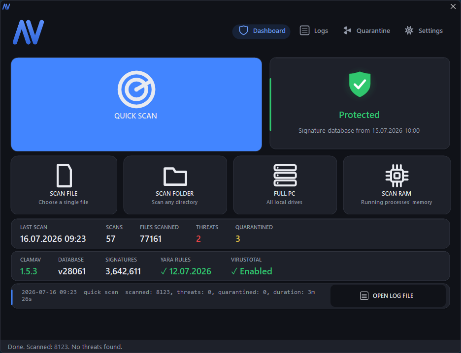
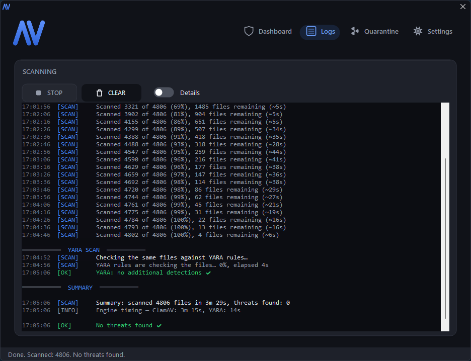
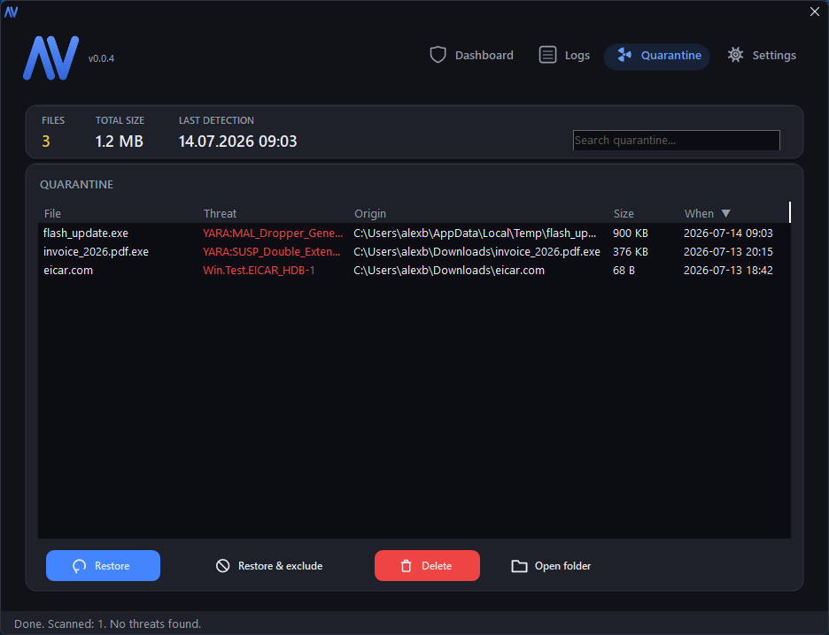
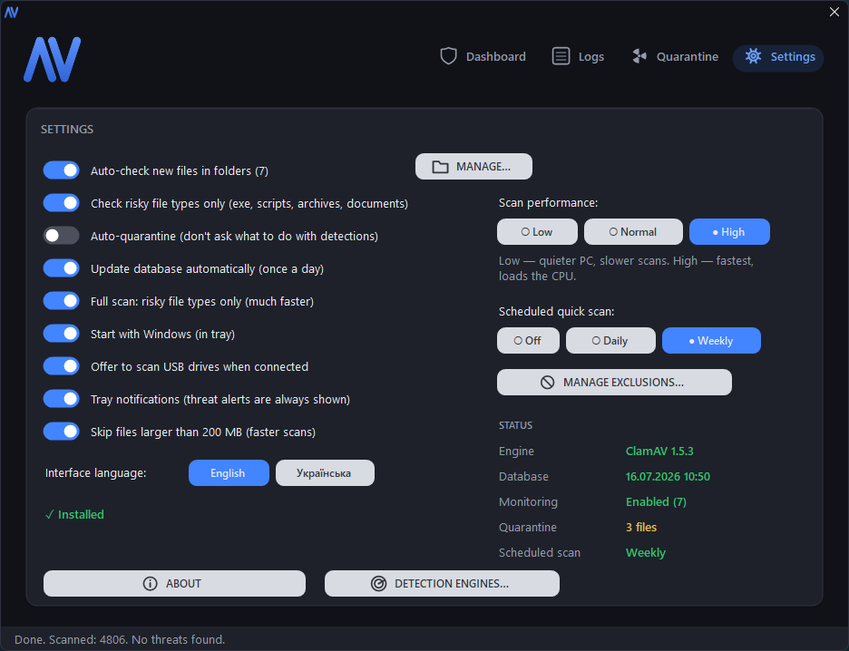

# AV

<p align="center">
  
</p>

[](LICENSE)
[](https://www.microsoft.com/windows)
[](https://dotnet.microsoft.com/download/dotnet-framework/net48)
[](../../releases/latest)
[](../../releases)
[](../../actions/workflows/tests.yml)


A lightweight **multi-engine antivirus for Windows** — three layers of
detection under one portable dashboard:

1. **ClamAV** — the classic signature engine (official, unmodified binaries);
2. **YARA rules** — community heuristics from [YARA Forge](https://yarahq.github.io/)
   that catch malware families and fresh threats signatures miss;
3. **VirusTotal** — suspicious files are checked by hash against 70+ engines,
   so a single false alarm from a heuristic rule doesn't turn into a
   needless scare.

The app itself is a single ~300 KB exe; the engines it orchestrates are
fetched automatically on first run (the ~220 MB ClamAV package plus its
~110 MB signature database, YARA with its rules ~10 MB) and kept updated.
Interface in
**English** and **Ukrainian**. Idle in the tray it uses under 15 MB of RAM;
nothing is installed system-wide and admin rights are never required.

<p align="center">
  
  
</p>
<p align="center">
  
  
</p>

## Quick start

1. Download `AV.exe` from the [latest release](../../releases/latest).
2. Run it. The first start asks: install per-user (shortcuts, "Apps" entry,
   no admin rights) or stay portable — a single folder you can carry around.
3. That's it. ClamAV with its signature database (~330 MB) and the YARA
   engine + rules (~10 MB) are downloaded automatically; the app keeps them
   updated and updates itself from GitHub Releases.

To get the VirusTotal layer, paste a free API key from
[virustotal.com](https://www.virustotal.com/) into **Settings →
DETECTION ENGINES…** — by default only file hashes are checked; uploading
unknown files is a separate opt-in toggle.

### "Windows protected your PC" warning

Downloading a release may trigger a SmartScreen / browser warning: the
executable is not code-signed, so every new release is an unknown file with
zero reputation for Windows. This is a reputation notice, not a detection —
each release is built from this repository by the public
[Release workflow](.github/workflows/release.yml). To run it anyway:
**More info → Run anyway**.

On Windows 11 with **Smart App Control** enabled the app is blocked
outright — Smart App Control allows only signed or well-known binaries and
has no per-app exceptions. It can only be switched off entirely (Windows
Security → App & browser control → Smart App Control; one-way — a Windows
reset is needed to re-enable it).

### Windows Defender deletes the app

Defender has flagged released builds as **`Trojan:Win32/Bearfoos.B!ml`** and
later as **`Trojan:Win32/Sonbokli.A!cl`**. Both are false positives, and the
suffixes say so: `!ml` is a verdict from the cloud machine-learning model,
`!cl` a cloud-delivered one. Neither is a signature match on anything in the
file — they are judgements about an unsigned .NET executable with no download
reputation.

Measured, not assumed: the released `AV.exe` is quarantined within a couple of
seconds of being downloaded, into any folder, while **the same source built
locally with `build.ps1` scans clean and is left alone**. The two binaries
differ only in their hash. Every release is built from this repository by the
public [Release workflow](.github/workflows/release.yml), so you can rebuild
it yourself and compare.

What makes this worse than a download warning: when Defender acts on the
verdict it removes the whole installation in one go — `AV.exe`, both
shortcuts, the autostart value and the "Apps" entry. The app is uninstalled
without being asked.

If you hit it:

- **Let the app exclude its own folder.** An installed copy offers this on
  first run through a one-time administrator prompt; it is the same exclusion
  the YARA engine needs (below), and it covers the exe too. Portable copies
  are only offered the narrow `yara` exclusion — the folder you dropped the
  exe into is yours, not the app's, and excluding it would be a real hole.
- **Report it** — [Microsoft Security Intelligence submission](https://www.microsoft.com/en-us/wdsi/filesubmission),
  as "Software developer". Microsoft clears confirmed false positives via a
  signature update, usually within a few days. Reports genuinely help, and are
  the only thing that actually removes the verdict. Each release is a new file
  with a fresh hash, so it has to be redone per release.
- **Restore the file** — Windows Security → Protection history → allow the
  item. Add the exclusion *first*: a restored file with a live verdict on it is
  taken again immediately. Note that self-update will re-download the flagged
  build from GitHub Releases, so an exclusion (or `autoupdate=0`) is what makes
  the restore stick.

### Defender deletes the YARA rules

A YARA rule file is, by construction, tens of thousands of literal malware
strings — which is exactly what a resident antivirus is built to react to.
Defender detects the plain YARA Forge rule set as
`Trojan:HTML/Sonbokli.A!cl` and deletes it, silently leaving the YARA engine
with nothing to compile.

The app never writes its rules to disk in plain form: they are streamed
straight out of the downloaded archive through an XOR (the same transform the
quarantine applies to `.quar` files) into `forge-core.yarx`, and the archive
itself is held in memory. Downloading and storing the rules is therefore
safe on its own.

Scanning is not. `yara64.exe` has to read real rule text, and a plain `.yar`
written anywhere Defender watches is taken within about a second — measured,
not assumed. So the app asks once, through a one-time administrator prompt,
for a Defender exclusion. **The YARA engine cannot work without it while
Defender's real-time protection is on.**

What gets excluded depends on where the app lives. An **install**
(`%LocalAppData%\Programs\AV`) excludes that folder: the app's own binaries,
its rules, and a quarantine whose contents are already stored neutralized —
nothing you open documents from. That single exclusion also keeps `AV.exe`
itself from being quarantined (above). A **portable** copy excludes only its
`yara` subfolder, never the folder you put the exe in. Declining leaves the
YARA pass off — ClamAV and VirusTotal keep working.

## What it can do

- Scan a file, a folder, or the **whole PC**; **Scan RAM** (live process
  memory — catches injected code masked on disk); **quick scan** of common
  infection points; scheduled quick scans (daily/weekly); or just
  **drag & drop** files onto the window
- **Auto-check of new files**: Downloads, Desktop, Program Files, Temp,
  AppData… are monitored, and new files are scanned by all engines
  automatically
- **Threat handling your way**: per-file choice of quarantine / delete /
  exclude — or silent auto-quarantine
- **Neutralized quarantine**: captured files are XOR-transformed `.quar`
  blobs that can't run and don't trip other antiviruses; everything is
  reversible from the Quarantine page
- **Smart false-positive handling**: a file flagged only by a heuristic rule
  is held untouched until VirusTotal confirms or clears it
- One-click database updates, a stale-database warning, app self-update,
  USB scan offer, exclusions, scan performance modes, color-coded log with
  per-phase progress

## Why this project?

Windows Defender is excellent, and this project is not intended to replace
it. It is a lightweight power-tool demonstrating how distinct, decoupled
detection systems — local signatures, local heuristic rules, and cloud
reputation — can be orchestrated under a single portable dashboard entirely
built in C#.

## For developers

The whole app builds with the `csc.exe` compiler already present in Windows —
no toolchain, no NuGet, one command:

```powershell
.\build.ps1
```

Architecture, the engine pipeline, trust tiers, project structure, and
contributor constraints live in **[README.DEV.md](README.DEV.md)** (and
`AGENTS.md` for AI-agent specifics).

## License

[Apache License 2.0](LICENSE). ClamAV® is a registered trademark of Cisco
Systems, Inc. (GPLv2, run as separate unmodified processes); YARA is ©
VirusTotal (BSD-3); rules by [YARA Forge](https://github.com/YARAHQ/yara-forge)
(licenses of the bundled rule sets apply); VirusTotal is used via its public
API under its terms of service. This project is an independent open-source UI
affiliated with none of them.
